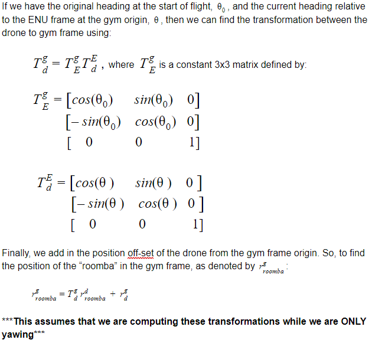

# Transformations-Ros
This repo is a catkin package that handels the transformations on our drone

## Vector Transformation: Drone -> Gym



# Deploying Vision to Jetson 

## Ssh to Jetson

how to find the ip address

run `ifconfig`

find the adreess that coresponds to the jetson ie enx000ec6da785e

run 
```
sudo arp-scan --localnet --interface=enx000ec6da785e
```

then ssh. Use -X for video forwarding
```
ssh -X ubuntu@10.42.0.112
```

## In order to run vision on the jetson you need 1 of each ros packages

```
Controls-ROS  
Darknet-Ros  
Transformations-Ros
cv3_bridge    
mavros       
video_stream_opencv
```
then run catkin build

## running vision on the jetson

start a video stream 
```
roslaunch video_stream_opencv webcam.launch
```
to verify the webcam is broadcasting in a new terminal run 

```
rosrun image_view image_view image:=/webcam/image_raw
```

To run yolo, enter the following:
```
roslaunch darknet_ros darknet_ros.launch 
```

To retrieve data from the pixhawk in a new terminal, run:
```
cd ~
./startup.sh
```

Now to run the facedown transformation node:
```

```